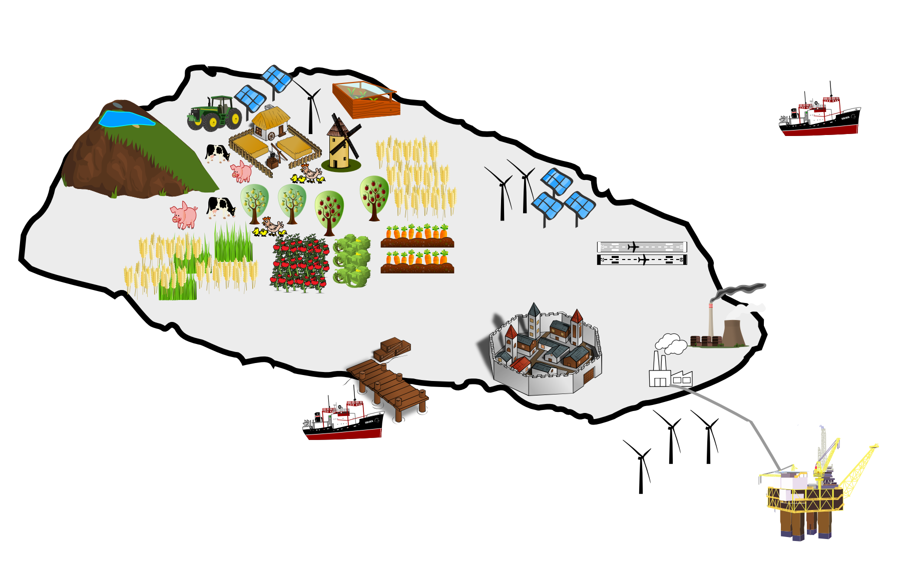

# Subsurface Energy Storage
Material for the Subsurface Energy and Fluid Storage and Extraction (SEFSE) at DTU
The final project of the course is to design subsurface storage and extraction process to address the intermittency of the wind and solar energy as the main source of energy of the inhabitants of the imaginary Paradise Island:

## Slides
* [Heat and heat storage](https://nbviewer.jupyter.org/github/simulkade/energystorage/blob/master/code/1-Introduction-slides.slides.html#/)  
* [First and second laws of thermodynamics- an overview and important equations](https://nbviewer.jupyter.org/github/simulkade/energystorage/blob/master/code/1-thermodynamics-slides.slides.html#/)  
* [Fossil fuels and their consumption](https://nbviewer.jupyter.org/github/simulkade/energystorage/blob/master/code/2-fuel-consumption.slides.html#/)  
* [Solar energy, food, and biofuels](https://nbviewer.jupyter.org/github/simulkade/energystorage/blob/master/code/3-food-solar-biomass.slides.html#/)  
* [Heating, electricity, CO2 emission, and carbon capture and storage](https://nbviewer.jupyter.org/github/simulkade/energystorage/blob/master/code/4-heating-electricity-CCS-pumps-compressors.slides.html#/)  
* [Embodied energy (to be completed)](https://nbviewer.jupyter.org/github/simulkade/energystorage/blob/master/code/5-material-energy-exercise.ipynb)  
* [Geothermal energy(to be completed)](https://nbviewer.jupyter.org/github/simulkade/energystorage/blob/master/code/day7-geothermal.ipynb)  
* [Synthetic fuel (e.g., power2x, e-refinery, CO2 recycling, ammonia, etc) storage](https://nbviewer.jupyter.org/github/simulkade/energystorage/blob/master/code/electrofuel-power2x-erefinery-etc-preliminary-estimations.slides.html)

## Notes
* [Introduction](https://nbviewer.jupyter.org/github/simulkade/energystorage/blob/master/code/1-Introduction.ipynb)  

Note that the above files are being regularly updated till the end of this course (and hopefully beyond).

## Mathematical models
[Analytical solution of oil-water subsurface flow](https://nbviewer.jupyter.org/github/simulkade/energystorage/blob/master/code/two-phase-flow-python.ipynb)

## Exam questions
These are the questions for the final oral exam:  
[Link](https://nbviewer.jupyter.org/github/simulkade/energystorage/blob/master/code/Questions-for-final-exam.ipynb)

## Thanks
* [thermo](https://github.com/CalebBell/thermo) by [Caleb Bell](https://github.com/CalebBell) and other contributors; I have not used it yet but soon will, because CoolProp does not have the enthalpy of formation in its database.  
* [CoolProp](https://github.com/CoolProp/CoolProp)
* [Jupyter Notebook extensions](https://github.com/ipython-contrib/jupyter_contrib_nbextensions)
* [RISE](https://github.com/damianavila/RISE)
